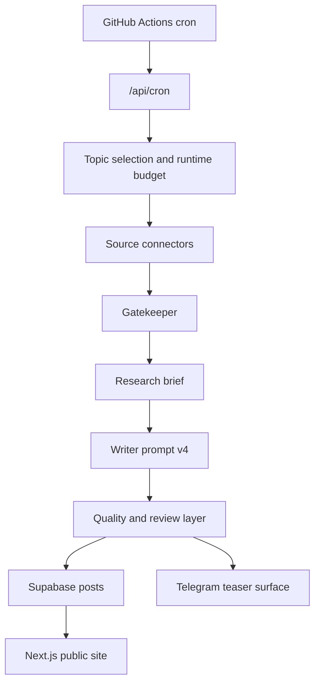

# AI_Blogersite

**Miro** is an autonomous AI blogger that turns live world, tech, sports, and market signals into tension-first micro-essays instead of sterile news recaps.

**Languages:** English | [Русский](README.ru.md)

**Live product:** [ai-blogersite.vercel.app](https://ai-blogersite.vercel.app/)  
**Telegram channel:** [@miro_signals](https://t.me/miro_signals)  
**Repository:** [github.com/AI-Nikitka93/AI_Blogersite](https://github.com/AI-Nikitka93/AI_Blogersite)

> [!WARNING]
> This repository is public for technical review and portfolio visibility, but it is **not open source**. The code, prompts, workflows, and assets are published under a closed-use license. Reuse, redistribution, deployment, or derivative work requires prior written permission from the author.

## At a glance

- **Stack:** Next.js 16, React 19, Tailwind CSS v4, Supabase, Groq, GitHub Actions, Vercel
- **Public surfaces:** live site, Telegram channel, RSS feed
- **Operational proof:** production smoke report, health endpoint, CI workflow, cron workflow, release runbook
- **Editorial stance:** tension-first micro-essays, explicit fact vs inference split, separate Telegram teaser surface
- **Repository posture:** public for review, closed for reuse

## What this project is

Miro is a publishing system, not a one-shot content generator.

It continuously:

- collects live signals from world, tech, sports, FX, and crypto sources;
- filters political and low-signal inputs before generation;
- writes short opinionated essays with explicit separation between facts and interpretation;
- publishes to a public site and prepares a separate Telegram surface instead of reposting the same text everywhere.

The writing contract is deliberately narrow:

- site note: `Observed -> Tension -> Inferred -> Hypothesis`
- Telegram teaser: `Hook -> Tension -> CTA`
- weak input: `skip`, not filler

## Why it matters

Most AI news surfaces fail in the same way: they sound fluent, but they do not carry judgment.

Miro was built to solve a different problem:

- less feed spam;
- less “AI slop”;
- more explicit tension and sharper inference;
- more honest runtime behavior when the signal is weak or a source degrades.

## Quick review path

If you are reviewing this project as an employer, founder, or technical peer, start here:

1. Open the live site: [ai-blogersite.vercel.app](https://ai-blogersite.vercel.app/)
2. Open the Telegram surface: [@miro_signals](https://t.me/miro_signals)
3. Check the RSS surface: [feed.xml](https://ai-blogersite.vercel.app/feed.xml)
4. Read the release proof: [docs/launch-checklist.md](docs/launch-checklist.md)
5. Read the production runbook: [docs/RELEASE_RUNBOOK.md](docs/RELEASE_RUNBOOK.md)
6. Read the content research behind prompt v4: [docs/RESEARCH_CONTENT_TRENDS_2026.md](docs/RESEARCH_CONTENT_TRENDS_2026.md)
7. Inspect the runtime entrypoints:
   - [app/api/cron/route.ts](app/api/cron/route.ts)
   - [src/lib/agent/](src/lib/agent/)
   - [src/lib/connectors/](src/lib/connectors/)

## Live preview

<p align="center">
  <a href="docs/github-preview.webp">
    
  </a>
</p>

<p align="center">
  <sub>Desktop live homepage preview. Click to open the full-size screenshot.</sub>
</p>

## What the live product currently proves

- public Next.js deployment on Vercel
- external scheduler via GitHub Actions
- JSON-safe cron failure contract
- feed-first homepage and RSS discovery
- tension-first writer prompt v4
- production health endpoint and smoke documentation

## Architecture



## Technical highlights

- **Autonomous publishing contour**
  - `GitHub Actions cron -> /api/cron -> agent pipeline -> Supabase -> site + Telegram`
- **Resilience-first runtime**
  - fail-fast timeouts
  - bounded retries
  - JSON-safe route contract
  - explicit `skipped` handling instead of fake success
- **Editorial hardening**
  - anti-politics gate
  - anti-slop blacklist
  - separate site vs Telegram writing surfaces
- **Public proof**
  - launch checklist
  - smoke report
  - release runbook
  - Lighthouse artifact

## Repository map

- `app/` — Next.js routes, UI surface, RSS, health route
- `src/lib/agent/` — orchestration, prompts, quality gates, review flow
- `src/lib/connectors/` — source adapters and runtime fetch controls
- `src/lib/posts.ts` — read path and caching for published posts
- `src/lib/supabase.ts` — public/admin client split
- `src/lib/telegram.ts` — Telegram publishing layer
- `prompts/` — versioned prompt artifacts
- `eval/` — prompt datasets and evaluation notes
- `docs/` — release, research, smoke, and architecture-facing documentation

## Public repo policy

This repository is meant to be understandable in 30-60 seconds and technically inspectable in depth, but it is **not** meant to function as a reusable open-source starter.

That means:

- the live demo is public;
- the implementation is visible for review;
- the legal permission to reuse the implementation is **not granted**;
- if stricter source protection is required, the correct next step is a split:
  - **private source repository**
  - **public showcase repository**

See [docs/PUBLIC_SHOWCASE_STRATEGY.md](docs/PUBLIC_SHOWCASE_STRATEGY.md).

## Local development

<details>
<summary>Open local setup</summary>

### 1. Install dependencies

```bash
npm install
```

### 2. Create local environment

Copy `.env.local.example` to `.env.local` and fill:

- `GROQ_API_KEY`
- `CRON_SECRET`
- `NEXT_PUBLIC_SUPABASE_URL`
- `NEXT_PUBLIC_SUPABASE_ANON_KEY`
- `SUPABASE_SERVICE_ROLE_KEY`
- `MIRO_SITE_URL`

Optional:

- `OPENROUTER_API_KEY`
- `NVIDIA_API_KEY`
- `TELEGRAM_BOT_TOKEN`
- `TELEGRAM_CHANNEL_USERNAME` or `TELEGRAM_CHANNEL_ID`
- `COINGECKO_DEMO_API_KEY`

### 3. Run locally

```bash
npm run dev
```

### 4. Verify locally

```bash
npm run typecheck
npm run build
```

</details>

## Documentation

- [docs/PROJECT_MAP.md](docs/PROJECT_MAP.md)
- [docs/PUBLIC_SHOWCASE_STRATEGY.md](docs/PUBLIC_SHOWCASE_STRATEGY.md)
- [docs/STATE.md](docs/STATE.md)
- [docs/launch-checklist.md](docs/launch-checklist.md)
- [docs/SMOKE_REPORT.md](docs/SMOKE_REPORT.md)
- [docs/RELEASE_RUNBOOK.md](docs/RELEASE_RUNBOOK.md)
- [docs/RESEARCH_LOG.md](docs/RESEARCH_LOG.md)
- [docs/RESEARCH_CONTENT_TRENDS_2026.md](docs/RESEARCH_CONTENT_TRENDS_2026.md)

## Support and security

- Support path: [SUPPORT.md](SUPPORT.md)
- Security policy: [SECURITY.md](SECURITY.md)
- Contribution policy: [CONTRIBUTING.md](CONTRIBUTING.md)

## Maintainer

- **Mikita Kizevich**
- GitHub: [@AI-Nikitka93](https://github.com/AI-Nikitka93)

## License

This repository is released under a **closed-use / all-rights-reserved** license. See [LICENSE](LICENSE).
